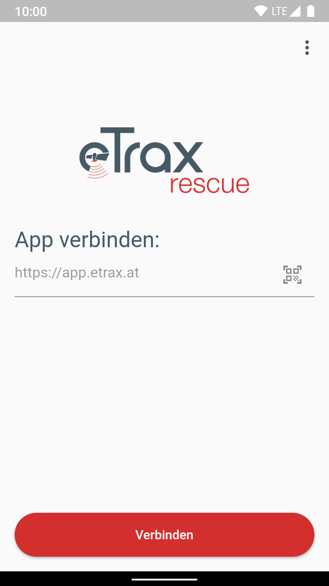
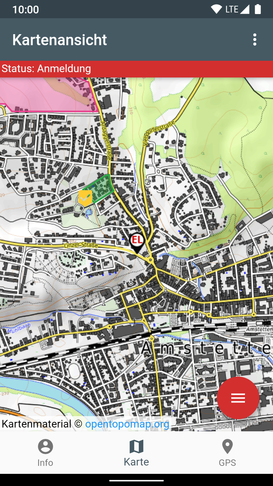

# eTrax | rescue App

[](https://github.com/etrax-rescue/etrax-rescue-app/actions)
[](https://codecov.io/gh/yozoon/etrax-rescue-app)

Die _eTrax | rescue_ App ist der offizielle Client des _eTrax | rescue_ Projektes, dessen Ziel es ist die Verwaltung von Personensuchen für Hilfsorganisationen zu vereinfachen, sowie die zentrale Koordination von Suchteams aus der Einsatzleitung zu ermöglichen. Die App ist sowohl für Android als auch für iOS verfügbar.

## Funktionsumfang

* **Anmeldung/ Rückmeldung zu einem Einsatz**
* **Statusmeldungen:** mit der App kann der Einsatzleitung der derzeitige Status gemeldet werden (In Anreise, Am Einsatzort, ...)
* **Live-Location-Tracking:** die App greift bei gewissen (von der Organisation festgelegten) Statusmeldungen auf den Gerätestandort zu und stellt diesen der Einsatzleitung zur Verfügung.
* **Setzen von Points of Interest (POIs):** die App ermöglicht es mit der Handykamera ein Foto aufzunehmen und dieses mit dazugehörigem Standort und einer kurzen Beschreibung zur Einsatzleitung zu schicken.
* **QuickActions:** Bestimmte Statusmeldungen werden in einer schnellzugriffs Schaltfläche verfügbar gemacht, damit diese mit nur wenigen Interaktionen zurückgemeldet werden können.

## Installation

### Über die App Stores

<p align="center">
<a href="https://play.google.com/store/apps/details?id=at.etrax.etrax_rescue_app&pcampaignid=pcampaignidMKT-Other-global-all-co-prtnr-py-PartBadge-Mar2515-1"></a>
</p>

### Manuell

> Die App wurde in [Dart](https://dart.dev/) geschrieben und verwendet das [Flutter](https://flutter.dev/) UI Toolkit. Um die App selbst zu builden muss daher die entsprechende Entwicklungsumgebung [installiert](https://flutter.dev/docs/get-started/install) sein.

1. git Repository herunterladen:

```bash
git clone https://github.com/etrax-rescue/etrax-rescue-app.git
cd etrax-rescue-app
```

2. Dependencies installieren/ updaten

 ```bash
 flutter pub upgrade
 ```
 
 3. App kompilieren
 
 ```bash
 flutter run --release
 ```

## Screenshots

<p align="center">


</p>

## App Architektur

Die Architektur der App basiert auf einer vereinfachten Version des [Clean Architecture Prinzips](https://blog.cleancoder.com/uncle-bob/2012/08/13/the-clean-architecture.html). Für die Implementierung wurde insbesondere die [Version](https://resocoder.com/flutter-clean-architecture-tdd/) dieses Architekturprinzips von Matt Rešetár als starke Inspiration herangezogen.

## Background Location Plugin

Da die Ortungsfunktionalität plattformspezifische Funktionen benötigt (Android/iOS) wurde sie als separates Plugin entwickelt, welches in folgendem Repository zu finden ist: https://github.com/etrax-rescue/flutter_background_location

---

Powered by
<p align="center">
  <a href='https://netidee.at/etrax-rescue'></a>
</p>
